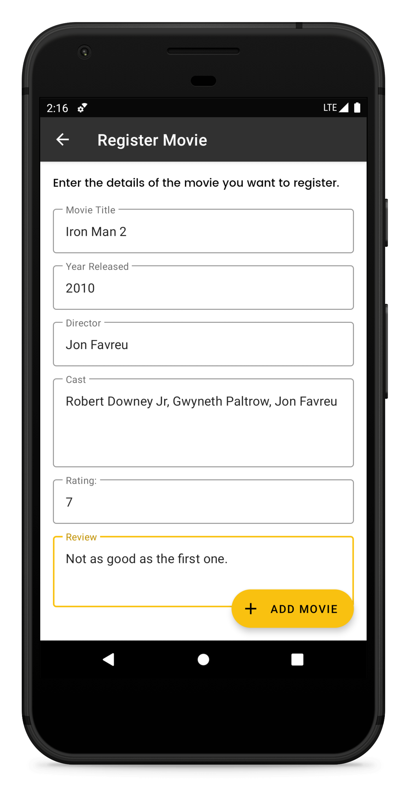
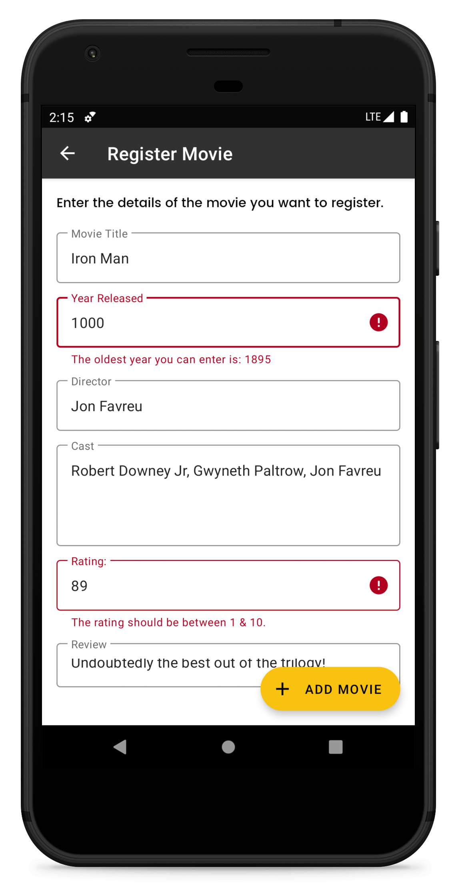
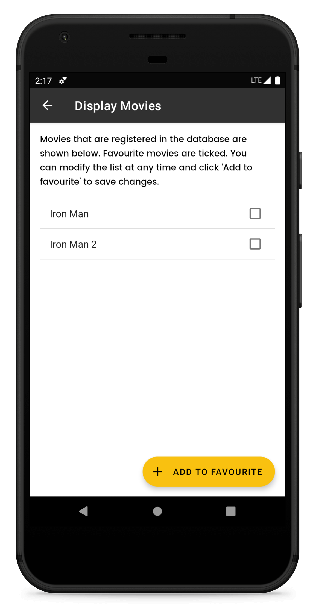
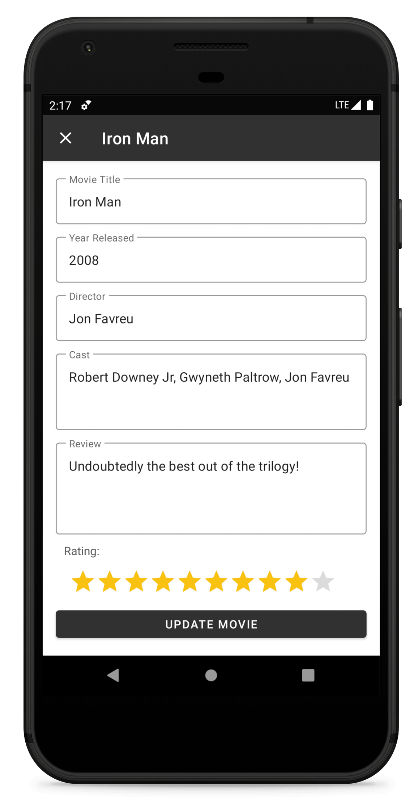
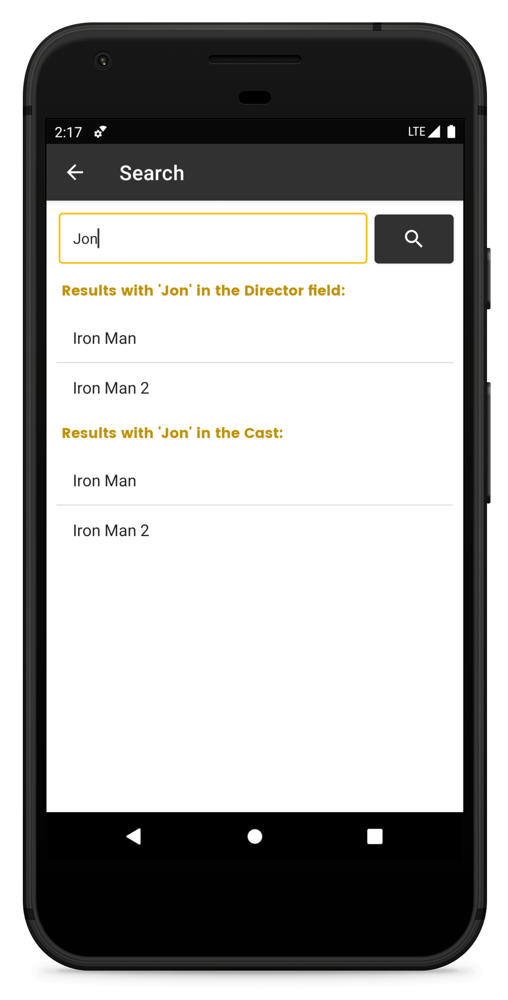
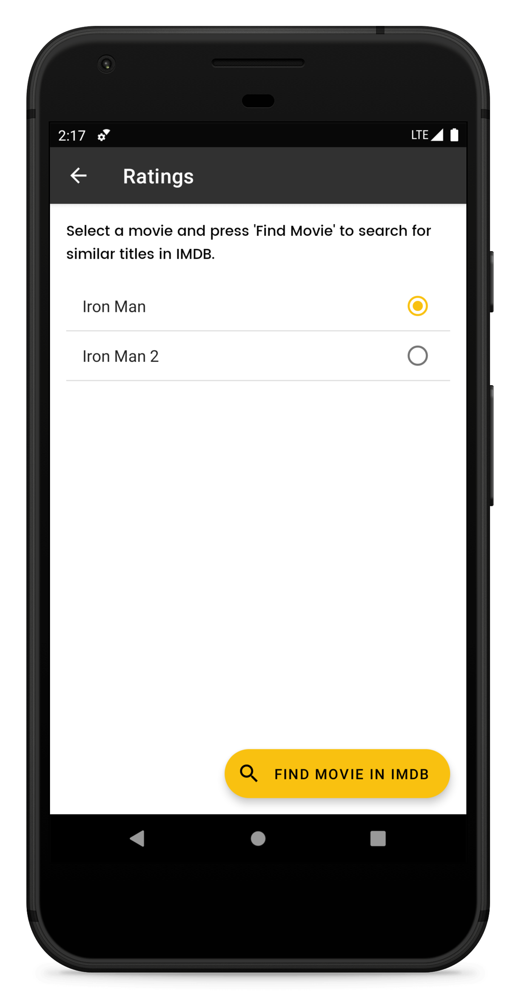
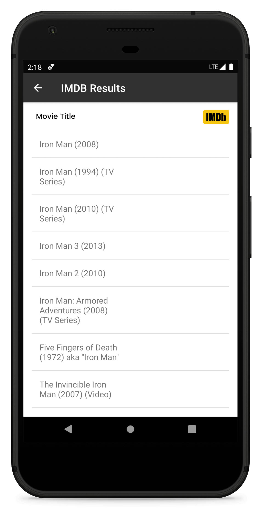
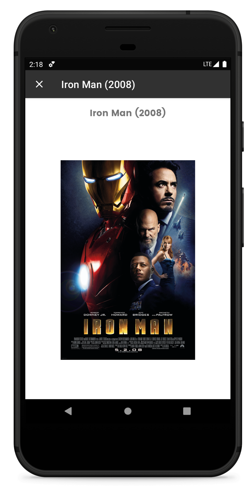

# MAD-CW02: Trakt (Movie Tracker)
This repo contains files for the project that was completed for Coursework 02 of the Mobile Application Development Module
in the 2nd year at IIT. The application allows the user to:
  1. Add details of watched movies
  2. Save watched movies as favourites
  3. View all movies/favourites
  4. Edit entered movie details
  5. Search added movies using Movie Title, Cast & Director
  6. Search for similiar movies in IMDB and display movie posters

SQLite was used for storage. UI was implemented using Material Design by Google.

## Screenshots

  
   
  
   
  
  
  
  
  

